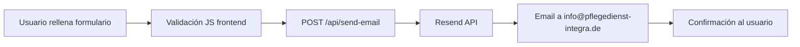

# 📋 Frontend-Backend Integration Guide - Integra Senior Care V2

## 📖 Resumen Ejecutivo

Este documento define la estructura del frontend Astro y los requerimientos de integración con el backend PHP para gestionar contenido dinámico y formularios de contacto de manera optimizada.

## 🎯 Objetivos de Integración

### **Sistema de Gestión de Contenido**
- **Gestión de textos** a través de API JSON desde PHP Admin
- **Formulario de contacto** con envío de emails procesado por PHP
- **Arquitectura liviana** que mantenga el rendimiento del frontend estático

### **Beneficios Esperados**
- ✅ **Actualización dinámica** de contenido sin redeploy
- ✅ **Gestión centralizada** desde panel PHP admin
- ✅ **Rendimiento optimizado** con caching inteligente
- ✅ **Escalabilidad** para futuras funcionalidades

---

## 🏗️ Arquitectura Frontend Actual

### **Framework y Tecnologías**
```json
{
  "framework": "Astro 4.x",
  "styling": "Tailwind CSS",
  "language": "TypeScript",
  "deployment": "Static Site Generation (SSG)",
  "current_text_management": "JSON estático (/src/utils/texts.json)"
}
```

### **Estructura de Componentes Principales**
```
src/
├── components/
│   ├── common/
│   │   ├── Header.astro          # Navegación principal
│   │   ├── Footer.astro          # Footer con links legales
│   │   ├── ContactForm.astro     # 🎯 CRÍTICO - Formulario principal
│   │   ├── Section.astro         # Container system
│   │   └── TextBlock.astro       # Bloques de texto reutilizables
│   ├── home/
│   │   ├── FormSection.astro     # 🎯 CRÍTICO - Sección de contacto
│   │   └── Experience.astro      # Sección de experiencia
│   ├── contact/
│   │   └── ContactText.astro     # 🎯 CRÍTICO - Página de contacto
│   └── faq/
│       └── FaqContent.astro      # 🎯 CRÍTICO - Preguntas frecuentes
├── pages/
│   ├── index.astro               # Landing page principal
│   ├── contact.astro             # Página de contacto
│   ├── faq.astro                 # Página FAQ
│   └── api/
│       └── send-email.ts         # 🎯 CRÍTICO - API actual de email
└── utils/
    ├── texts.json                # 🎯 CRÍTICO - Archivo de textos actual
    └── legal_texts.json          # Textos legales
```

---

## 📊 Sistema de Textos Actual

### **Estructura JSON Existente**
El archivo `/src/utils/texts.json` contiene **~600 líneas** organizadas por secciones:

```json
{
  "seo": { /* Metadatos SEO por página */ },
  "header": {
    "address": "Flughafenstraße 404, 44328 Dortmund",
    "phone": "0231 9125000",
    "schedule": "Mo-Fr: 8:00-16:00 Uhr",
    "socialLinks": { /* Enlaces sociales */ },
    "nav": { /* Enlaces de navegación */ },
    "buttonText": "Jetzt anrufen"
  },
  "home": {
    "heroSection": { /* Sección hero */ },
    "aboutSection": { /* Acerca de */ },
    "servicesSection": { /* Servicios */ },
    "formSection": {
      "subtitle": "Kontaktieren Sie uns",
      "title": "Wir sind für Sie da - jederzeit",
      "description": "...",
      "contactForm": {
        "title": "Ihre Fragen<br>Unser Expertenrat!",
        "inputFields": [
          { "type": "text", "placeholder": "Vollständiger Name" },
          { "type": "tel", "placeholder": "Telefonnummer" },
          { "type": "email", "placeholder": "E-Mail-Adresse" }
        ],
        "selectOptions": [
          "Gewünschte Leistung",
          "Häusliche Pflege",
          "Medizinische Versorgung"
        ],
        "textareaPlaceholder": "Ihre Nachricht",
        "buttonText": "Absenden"
      }
    }
  },
  "contact": {
    "title": "Kontakt",
    "subtitle": "Wir sind für Sie da",
    "description": "...",
    "contactOptions": [
      {
        "icon": "location",
        "title": "Unser Standort", 
        "description": "Flughafenstraße 404, 44328 Dortmund"
      },
      {
        "icon": "mobilePhone",
        "title": "Rufen Sie uns an",
        "description": "0231 9125000"
      },
      {
        "icon": "envelope", 
        "title": "Schreiben Sie uns",
        "description": "info@pflegedienst-integra.de"
      }
    ],
    "contactForm": { /* Configuración del formulario */ }
  },
  "faq": {
    "title": "Häufig gestellte Fragen",
    "subtitle": "Antworten auf Ihre Fragen",
    "faqItems": [
      {
        "question": "Welche Pflegeleistungen bieten Sie an?",
        "answer": "Wir bieten ein umfassendes Spektrum..."
      }
    ],
    "contactForm": { /* Formulario de FAQ */ }
  }
}
```

### **Componentes que Consumen Textos**
```typescript
// Ejemplo de uso actual en componentes
---
import texts from "@/utils/texts.json";
const { header, home, contact, faq } = texts;
---

<!-- Los componentes reciben props del JSON -->
<ContactForm {...home.formSection.contactForm} />
<TextBlock 
  title={home.heroSection.title}
  subtitle={home.heroSection.subtitle}
  description={home.heroSection.description}
/>
```

---

## 📧 Sistema de Email Actual

### **API Endpoint Existente**
**Archivo**: `/src/pages/api/send-email.ts`

```typescript
// Configuración actual
import { Resend } from 'resend';

export async function POST({ request }: APIContext) {
  const formData = await request.formData();
  
  // Campos del formulario
  const name = formData.get('name') as string;
  const email = formData.get('email') as string; 
  const phone = formData.get('phone') as string;
  const subject = formData.get('subject') as string;
  const message = formData.get('message') as string;

  // Envío con Resend
  const { data, error } = await resend.emails.send({
    from: "Your Name <onboarding@resend.dev>",
    to: ["info@pflegedienst-integra.de"],
    subject: `New contact form submission: ${subject}`,
    html: `<!-- Template HTML completo -->`,
  });
}
```

### **Componente ContactForm.astro**
- **Validación frontend**: Números de teléfono alemanes, emails, campos requeridos
- **UX avanzada**: Modales de confirmación, tooltips WCAG 2.2
- **Campos del formulario**:
  - `name` (text): Nombre completo
  - `email` (email): Email válido
  - `phone` (tel): Teléfono alemán (+49...)
  - `subject` (select): Asunto predefinido
  - `message` (textarea): Mensaje libre
  - `consent` (checkbox): Consentimiento GDPR

### **Flujo Actual de Email**


---

## 🎯 Requerimientos para el Backend PHP

### **1. API de Gestión de Textos**

#### **Endpoint propuesto**: `/api/content`
```php
// GET /api/content - Obtener todos los textos
// GET /api/content/{section} - Obtener sección específica
// PUT /api/content/{section} - Actualizar sección (admin)

// Respuesta JSON esperada (compatible con estructura actual)
{
  "success": true,
  "data": {
    "header": { /* textos del header */ },
    "home": { /* textos del home */ },
    "contact": { /* textos de contacto */ },
    "faq": { /* textos de FAQ */ }
  },
  "cache_key": "content_v1.2.3",
  "last_updated": "2024-12-08T10:30:00Z"
}
```

#### **Base de Datos Sugerida**
```sql
-- Tabla principal de contenido
CREATE TABLE content_sections (
    id INT PRIMARY KEY AUTO_INCREMENT,
    section_key VARCHAR(50) NOT NULL UNIQUE, -- 'header', 'home', 'contact', 'faq'
    content_json JSON NOT NULL,
    version INT DEFAULT 1,
    created_at TIMESTAMP DEFAULT CURRENT_TIMESTAMP,
    updated_at TIMESTAMP DEFAULT CURRENT_TIMESTAMP ON UPDATE CURRENT_TIMESTAMP,
    updated_by INT REFERENCES users(id)
);

-- Tabla de historial para versionado
CREATE TABLE content_history (
    id INT PRIMARY KEY AUTO_INCREMENT,
    section_key VARCHAR(50) NOT NULL,
    content_json JSON NOT NULL,
    version INT NOT NULL,
    action ENUM('create', 'update', 'delete') NOT NULL,
    created_at TIMESTAMP DEFAULT CURRENT_TIMESTAMP,
    created_by INT REFERENCES users(id)
);

-- Índices para optimización
CREATE INDEX idx_section_key ON content_sections(section_key);
CREATE INDEX idx_updated_at ON content_sections(updated_at);
```

#### **Admin Panel Requerimientos**
- **Editor visual** para textos con preview en tiempo real
- **Validación de estructura JSON** antes de guardar
- **Versionado** con posibilidad de rollback
- **Cache invalidation** automática después de cambios
- **Preview mode** para ver cambios antes de publicar

### **2. API de Email Processing**

#### **Endpoint propuesto**: `/api/email/send`
```php
// POST /api/email/send
// Content-Type: application/json

// Request body esperado
{
  "name": "María González",
  "email": "maria@example.com", 
  "phone": "+49 231 9125000",
  "subject": "general", // o "services", "appointment", "emergency"
  "message": "Texto del mensaje...",
  "consent": true,
  "form_type": "contact", // o "faq", "home"
  "page_url": "https://domain.com/contact",
  "user_agent": "Mozilla/5.0...",
  "ip_address": "192.168.1.1"
}

// Response esperada
{
  "success": true,
  "message": "Email enviado correctamente",
  "tracking_id": "em_20241208_001",
  "estimated_response": "24-48 horas"
}
```

#### **Base de Datos para Emails**
```sql
-- Tabla de emails enviados
CREATE TABLE email_submissions (
    id INT PRIMARY KEY AUTO_INCREMENT,
    tracking_id VARCHAR(50) UNIQUE NOT NULL,
    name VARCHAR(255) NOT NULL,
    email VARCHAR(255) NOT NULL,
    phone VARCHAR(50),
    subject VARCHAR(100) NOT NULL,
    message TEXT NOT NULL,
    form_type ENUM('contact', 'faq', 'home') NOT NULL,
    page_url VARCHAR(500),
    user_agent TEXT,
    ip_address VARCHAR(45),
    status ENUM('pending', 'sent', 'failed', 'responded') DEFAULT 'pending',
    sent_at TIMESTAMP NULL,
    responded_at TIMESTAMP NULL,
    created_at TIMESTAMP DEFAULT CURRENT_TIMESTAMP,
    
    -- Campos adicionales para seguimiento
    email_provider VARCHAR(100), -- 'resend', 'smtp', 'sendgrid'
    email_id VARCHAR(255), -- ID del proveedor de email
    bounce_reason TEXT,
    spam_score DECIMAL(3,2),
    
    INDEX idx_email (email),
    INDEX idx_tracking_id (tracking_id),
    INDEX idx_created_at (created_at),
    INDEX idx_status (status)
);

-- Tabla de plantillas de email
CREATE TABLE email_templates (
    id INT PRIMARY KEY AUTO_INCREMENT,
    template_key VARCHAR(50) NOT NULL UNIQUE, -- 'contact_notification', 'auto_response'
    subject_template VARCHAR(255) NOT NULL,
    html_template TEXT NOT NULL,
    text_template TEXT,
    variables JSON, -- Variables disponibles para la plantilla
    is_active BOOLEAN DEFAULT TRUE,
    created_at TIMESTAMP DEFAULT CURRENT_TIMESTAMP,
    updated_at TIMESTAMP DEFAULT CURRENT_TIMESTAMP ON UPDATE CURRENT_TIMESTAMP
);
```

#### **Funcionalidades de Email Requeridas**
1. **Envío de notificación** a `info@pflegedienst-integra.de`
2. **Auto-respuesta** al usuario confirmando recepción
3. **Plantillas HTML** personalizables desde admin
4. **Tracking de entregas** y aperturas (opcional)
5. **Sistema de spam protection** con rate limiting
6. **Backup de proveedores** (Resend, SMTP, SendGrid)

---

## 🔄 Integración Frontend-Backend

### **Estrategia de Migración**

#### **Fase 1: Setup de APIs**
```javascript
// 1. Modificar build process de Astro
// astro.config.mjs
export default defineConfig({
  output: 'hybrid', // Permite SSR en páginas específicas
  adapter: node({
    mode: 'standalone'
  }),
  integrations: [
    // Configurar cache para APIs
  ]
});

// 2. Crear service layer para APIs
// src/services/ContentService.ts
export class ContentService {
  private static baseUrl = import.meta.env.PUBLIC_API_BASE_URL;
  
  static async getContent(section?: string) {
    const url = section 
      ? `${this.baseUrl}/api/content/${section}`
      : `${this.baseUrl}/api/content`;
      
    const response = await fetch(url);
    return response.json();
  }
  
  static async sendEmail(data: EmailData) {
    const response = await fetch(`${this.baseUrl}/api/email/send`, {
      method: 'POST',
      headers: { 'Content-Type': 'application/json' },
      body: JSON.stringify(data)
    });
    return response.json();
  }
}
```

#### **Fase 2: Componentes Híbridos**
```astro
---
// src/components/common/ContactForm.astro (modificado)
import { ContentService } from '@/services/ContentService';

// Cargar textos desde API en build time o runtime
const contactFormTexts = await ContentService.getContent('home.formSection.contactForm');
---

<form id="contact-form">
  <!-- Formulario dinámico basado en API -->
  {contactFormTexts.inputFields.map(field => (
    <input type={field.type} placeholder={field.placeholder} />
  ))}
</form>

<script>
// Envío a través de PHP backend
const form = document.getElementById('contact-form');
form.addEventListener('submit', async (e) => {
  e.preventDefault();
  const formData = new FormData(form);
  const data = Object.fromEntries(formData);
  
  try {
    const result = await ContentService.sendEmail(data);
    if (result.success) {
      showSuccessModal(result.message);
    }
  } catch (error) {
    showErrorModal('Error al enviar el formulario');
  }
});
</script>
```

#### **Fase 3: Cache Strategy**
```javascript
// src/utils/CacheManager.ts
export class CacheManager {
  private static cache = new Map();
  private static TTL = 5 * 60 * 1000; // 5 minutos
  
  static async get(key: string, fetcher: Function) {
    const cached = this.cache.get(key);
    
    if (cached && Date.now() - cached.timestamp < this.TTL) {
      return cached.data;
    }
    
    const data = await fetcher();
    this.cache.set(key, { data, timestamp: Date.now() });
    return data;
  }
  
  static invalidate(pattern?: string) {
    if (pattern) {
      // Invalidar claves que coincidan con el patrón
      for (const [key] of this.cache) {
        if (key.includes(pattern)) {
          this.cache.delete(key);
        }
      }
    } else {
      this.cache.clear();
    }
  }
}
```

### **Variables de Entorno Requeridas**
```bash
# Frontend (.env)
PUBLIC_API_BASE_URL=https://admin.pflegedienst-integra.de
PUBLIC_SITE_URL=https://pflegedienst-integra.de
PUBLIC_CACHE_TTL=300000

# Backend PHP (.env)
DB_HOST=localhost
DB_NAME=integra_cms
DB_USER=integra_user
DB_PASS=secure_password

MAIL_DRIVER=resend
RESEND_API_KEY=re_xxxxx
MAIL_FROM_ADDRESS=noreply@pflegedienst-integra.de
MAIL_TO_ADDRESS=info@pflegedienst-integra.de

CACHE_DRIVER=redis
REDIS_HOST=localhost
REDIS_PORT=6379
```

---

## 🚀 Recomendaciones de Implementación

### **Arquitectura Sugerida**
```
┌─────────────────┐    ┌──────────────────┐    ┌─────────────────┐
│   Astro SSG     │    │   PHP Backend    │    │   Database      │
│   Frontend      │◄──►│   Admin API      │◄──►│   MySQL/Redis   │
└─────────────────┘    └──────────────────┘    └─────────────────┘
         │                       │                       │
         │              ┌──────────────────┐            │
         └─────────────►│   CDN / Cache    │◄───────────┘
                        │   (Cloudflare)   │
                        └──────────────────┘
```

### **Consideraciones de Rendimiento**
1. **Cache Layers**:
   - **Browser Cache**: 24h para contenido estático
   - **CDN Cache**: 1h para API responses
   - **Server Cache**: 5min para contenido dinámico
   - **Database Query Cache**: Optimización de consultas frecuentes

2. **Optimizaciones**:
   - **API Response Compression**: Gzip habilitado
   - **Database Indexing**: Índices en columnas frecuentemente consultadas
   - **Connection Pooling**: Para múltiples requests concurrentes
   - **Rate Limiting**: Prevención de spam y DDoS

### **Seguridad**
1. **Autenticación Admin**: JWT tokens con refresh
2. **CORS Policy**: Restringir orígenes permitidos
3. **Input Validation**: Sanitización de todos los inputs
4. **SQL Injection Prevention**: Prepared statements
5. **XSS Protection**: Escape de contenido HTML
6. **CSRF Protection**: Tokens en formularios

### **Monitoreo y Logs**
```php
// Logger sugerido para PHP
$logger->info('Content updated', [
    'section' => $section,
    'user_id' => $userId,
    'changes' => $diff,
    'ip' => $request->ip()
]);

$logger->info('Email sent', [
    'tracking_id' => $trackingId,
    'recipient' => $email,
    'form_type' => $formType,
    'response_time' => $responseTime
]);
```

---

## 📈 Roadmap de Implementación

### **Sprint 1 (Semana 1-2): Backend Foundation**
- [ ] Setup de base de datos y tablas
- [ ] Implementación de API `/api/content`
- [ ] Panel admin básico para gestión de contenido
- [ ] Testing de APIs con Postman/Insomnia

### **Sprint 2 (Semana 3): Email System**
- [ ] Implementación de API `/api/email/send`
- [ ] Configuración de proveedores de email
- [ ] Plantillas de email HTML
- [ ] Testing de envío de emails

### **Sprint 3 (Semana 4): Frontend Integration**
- [ ] Modificación de components para usar APIs
- [ ] Implementación de cache strategy
- [ ] Testing de integración completa
- [ ] Optimización de rendimiento

### **Sprint 4 (Semana 5): Production Ready**
- [ ] Configuración de entornos staging/production
- [ ] Monitoreo y logging
- [ ] Documentación técnica
- [ ] Go-live y monitoring

---

## 🔧 Herramientas de Desarrollo

### **Testing APIs**
```bash
# Ejemplo de requests para testing
curl -X GET "https://admin.pflegedienst-integra.de/api/content/header" \
  -H "Accept: application/json"

curl -X POST "https://admin.pflegedienst-integra.de/api/email/send" \
  -H "Content-Type: application/json" \
  -d '{
    "name": "Test User",
    "email": "test@example.com",
    "phone": "+49 123 456789",
    "subject": "general",
    "message": "Test message"
  }'
```

### **Postman Collection**
Se recomienda crear una colección de Postman con todos los endpoints y casos de prueba para facilitar el desarrollo y testing.

---

## ✅ Checklist de Entregables

### **Backend PHP (Responsabilidad del equipo backend)**
- [ ] API REST `/api/content` con CRUD completo
- [ ] API REST `/api/email/send` con validación
- [ ] Panel de administración web
- [ ] Base de datos optimizada con índices
- [ ] Sistema de cache (Redis recomendado)
- [ ] Logging y monitoreo
- [ ] Documentación de API (Swagger)
- [ ] Tests unitarios y de integración

### **Frontend Adjustments (Responsabilidad del equipo frontend)**
- [ ] Service layer para comunicación con APIs
- [ ] Modificación de componentes para usar contenido dinámico
- [ ] Implementación de cache en frontend
- [ ] Manejo de errores y fallbacks
- [ ] Testing de integración
- [ ] Optimización de builds

### **DevOps & Deployment**
- [ ] Configuración de entornos (staging/production)
- [ ] Pipeline CI/CD
- [ ] Monitoring y alertas
- [ ] Backup y recovery procedures
- [ ] SSL certificates y security headers

---

## 📞 Contacto y Soporte

Para dudas técnicas sobre la integración, contactar:
- **Frontend Lead**: [Información de contacto]
- **Backend Lead**: [Información de contacto]  
- **DevOps**: [Información de contacto]

---

**Documento generado**: 8 de Diciembre, 2024  
**Versión**: 1.0  
**Próxima revisión**: Al finalizar Sprint 1
